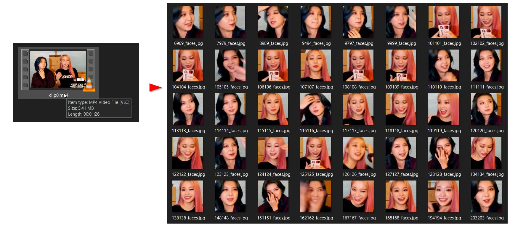

# video-to-meme-pics 🤡

 
 

Create memes from a video instantly. Basically, this program extracts faces from a video frame by frame.

- Install dependecies by running `pip install -r requirements.txt`
- Place the mp4 video in `/videos`
- Run `python start.py`

# Examples
